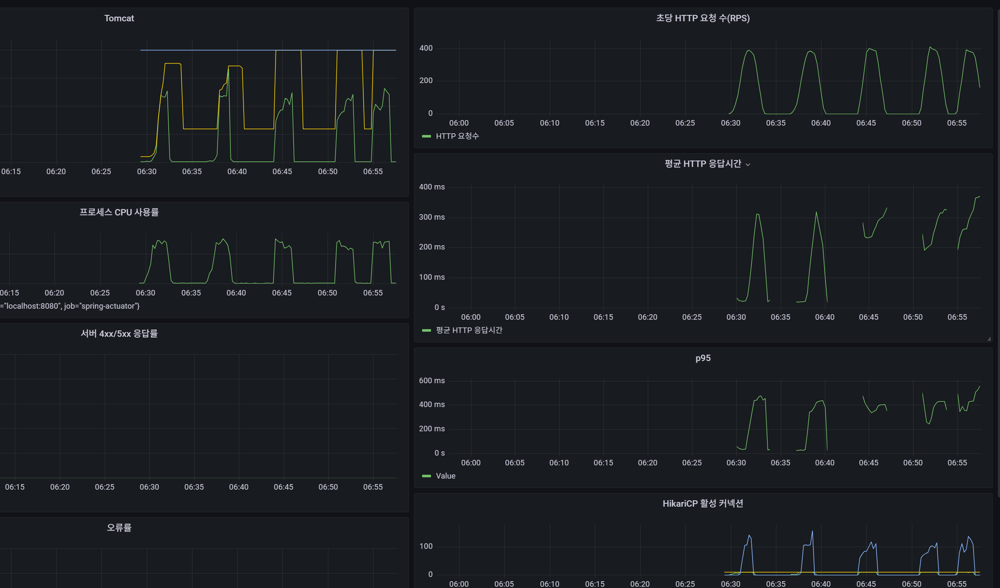
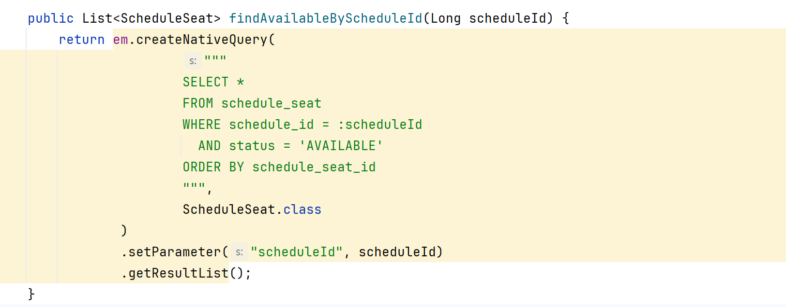
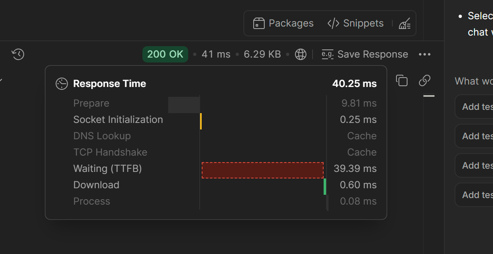
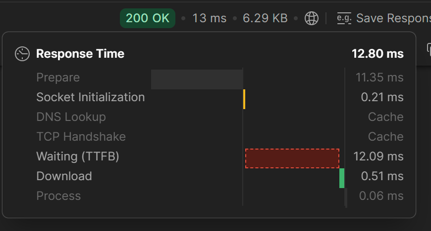
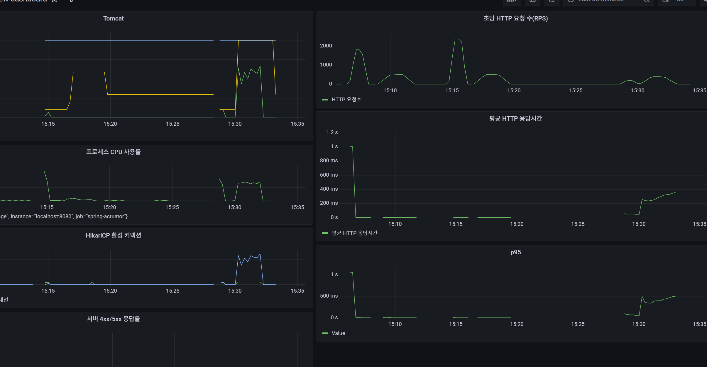

아래 경우 는  500/3m(점진적 2번) 500/2m(순간적 3번) {예열을 한상태}

처음 2번은 점진적  나머지 3번은 spike
- 실험결과    
  순간적으로 spike를 쳐서 connection를 기다리는 요청수가 있음   
  DB에  pending이 증가하는것을 알수가있음   
  pending이 증가하여 응답하는 시간 증가한것을 알수가있음

정리
------- 
- ## 최적화 전 부하 테스트 현황

### 테스트 구분

- 첫 번째, 두 번째 테스트: VU를 점진적으로 증가
- 세 번째부터 다섯 번째 테스트: VU 500 Spike
- HikariCP 최대 커넥션: 10개
- 동일 API와 데이터, `sleep(1)` 조건 사용

### Spike 테스트 대표 결과

- RPS: 392.77
- 평균 응답시간: 263.91ms
- p95: 365.38ms
- 최대 응답시간: 1.02s
- 실패율: 0.53%
- 실패 요청: 256 / 47,654

### 관찰한 현상

Spike 부하가 시작되면 HikariCP pending이 100개 이상 증가했다.

pending은 요청이 DB 커넥션을 얻지 못하고 기다리는 상태를 의미한다. pending이 증가한 구간에서 평균 응답시간과 p95도 함께 증가했다.

CPU 사용률에는 여유가 있었으므로 현재 병목 후보는 CPU보다 DB 접근 구간에 가깝다고 판단했다.

### 현재 가설

API 한 번을 호출했을 때 연관 엔티티 조회 SQL이 다수 발생하는 것을 확인했다.

다량의 SQL로 인해 요청 하나가 DB 커넥션을 오래 점유하고, Spike 상황에서 커넥션을 기다리는 요청이 누적된 것으로 추정한다.

아직 커넥션 풀 크기 자체가 부족하다고 확정할 수는 없다.

### 다음 실험

1. DTO 직접 조회를 적용해 SQL 실행 횟수를 한 번으로 줄인다.
2. HikariCP 최대 커넥션은 10개로 유지한다.
3. 동일한 VU 500 Spike 테스트를 실행한다.
4. RPS, 평균, p95, 실패율, HikariCP pending을 최적화 전과 비교한다.
5. 쿼리 개선 후에도 pending이 크면 커넥션 풀 크기 비교를 진행한다.

###  쿼리개선 방향(단일 테스트,postman)
- 개선 전에는 엔티티 조회와 EAGER 연관관계 초기화 과정에서 N+1 추가 쿼리가 발생했다.
  - Fetch Join으로 연관 엔티티를 한 번에 조회할 수도 있지만, 해당 API는 엔티티 자체가 필요하지 않아      
            DTO Projection으로 필요한 컬럼만 단일 쿼리로 조회했다.
- 이유 : 엔티티 자체가 필요한경우는 수정이나 비즈니스 로직을 직접수행할떄이므로  조회일떄는 필요하지않다고 판단했다.    
    - cf) 조회 API는 DTO 중심, 선점·결제 같은 명령 API는 엔티티 중심

현재 : 조회후 기존에는 EAGER로 해서 연관 객체를 또 따로 쿼리를 날리고있었음 
 --> 10번정도 한결과 40~30ms를 왔다갔다함 
최적화 : DTO Projection로 필요한 값만 받아서 처리 
 --> 10번정도 한결과 8~ 13ms를 왔다갔다함 
4배정도 개선됬음  

█ TOTAL RESULTS (개선이전 )

    checks_total.......: 93530  771.065022/s
    checks_succeeded...: 99.15% 92744 out of 93530
    checks_failed......: 0.84%  786 out of 93530

    ✗ 응답 상태는 200이다
      ↳  99% — ✓ 46372 / ✗ 393
    ✗ AVAILABLE 좌석은 90개다
      ↳  99% — ✓ 46372 / ✗ 393

    HTTP
    http_req_duration..............: avg=286.46ms min=0s      med=292.17ms max=1.63s p(90)=371.76ms p(95)=425.53ms     
      { expected_response:true }...: avg=288.88ms min=17.59ms med=292.56ms max=1.63s p(90)=372.24ms p(95)=425.97ms     
    http_req_failed................: 0.84%  393 out of 46765
    http_reqs......................: 46765  385.532511/s

    EXECUTION
    iteration_duration.............: avg=1.28s    min=1.01s   med=1.29s    max=2.64s p(90)=1.37s    p(95)=1.42s        
    iterations.....................: 46765  385.532511/s
    vus............................: 135    min=135          max=500
    vus_max........................: 500    min=500          max=500

    NETWORK
    data_received..................: 296 MB 2.4 MB/s
    data_sent......................: 4.0 MB 33 kB/s

█ TOTAL RESULTS(개선이후)

    checks_total.......: 120000 993.240553/s
    checks_succeeded...: 99.36% 119238 out of 120000
    checks_failed......: 0.63%  762 out of 120000

    ✗ 응답 상태는 200이다
      ↳  99% — ✓ 59619 / ✗ 381
    ✗ AVAILABLE 좌석은 90개다
      ↳  99% — ✓ 59619 / ✗ 381

    HTTP
    http_req_duration..............: avg=3.48ms min=0s med=2.53ms max=72.91ms p(90)=6.04ms p(95)=8.47ms
      { expected_response:true }...: avg=3.5ms  min=0s med=2.54ms max=72.91ms p(90)=6.05ms p(95)=8.49ms
    http_reqs......................: 60000  496.620276/s

    EXECUTION
    iteration_duration.............: avg=1s     min=1s med=1s     max=1.19s   p(90)=1s     p(95)=1.01s
    iterations.....................: 60000  496.620276/s
    vus............................: 500    min=500          max=500
    vus_max........................: 500    min=500          max=500

    NETWORK
    data_received..................: 381 MB 3.2 MB/s
    data_sent......................: 5.2 MB 43 kB/s

이전이 커리를 최적한후, 이후가 쿼리를 최적하기전임 

- 결론 : 그래프 를 보면 DB connection만 점유하는것이 아닌  Tomcat스레드도 반환하지않고 같이 점유하는 현상을 해석가능    
      N+1문제를 해결한 후      
-> DTO 조회로 최적화하면 DB 커넥션을 빨리 반환할 뿐 아니라, Tomcat 스레드가 요청 하나에 묶이는 시간도 함께 줄어드는 것
- -------------------------------
## DTO 직접 조회 적용 전후 부하 테스트 비교

### 테스트 조건

- 가상 사용자: 500 VU
- 실행 시간: 2분
- Think time: 1초
- 조회 대상: 특정 스케줄의 AVAILABLE 좌석 90개
- 개선 전: 엔티티 조회 및 연관 엔티티 추가 조회
- 개선 후: DTO Projection으로 필요한 값만 단일 쿼리 조회

### 측정 결과

| 지표 | 개선 이전 | 개선 이후 | 변화 |
|---|---:|---:|---:|
| 전체 요청 수 | 46,765 | 60,000 | 28.3% 증가 |
| RPS | 385.53/s | 496.62/s | 28.8% 증가 |
| 평균 응답시간 | 286.46ms | 3.48ms | 98.8% 감소 |
| 중앙값 | 292.17ms | 2.53ms | 99.1% 감소 |
| p90 | 371.76ms | 6.04ms | 98.4% 감소 |
| p95 | 425.53ms | 8.47ms | 98.0% 감소 |
| 최대 응답시간 | 1.63초 | 72.91ms | 95.5% 감소 |
| 요청 실패 수 | 393건 | 381건 | 3.1% 감소 |
| 요청 실패율 | 0.84% | 0.63% | 0.21%p 감소 |
| 평균 반복 시간 | 1.28초 | 1초 | 21.9% 감소 |
| 수신 데이터 | 296MB | 381MB | 28.7% 증가 |

### 결과 해석

DTO Projection을 적용한 이후 RPS가 약 28.8% 증가하여 같은 2분 동안 처리한 요청 수가 46,765건에서 60,000건으로 증가했다.

평균 응답시간은 286.46ms에서 3.48ms로 약 98.8% 감소했고, p95 응답시간도 425.53ms에서 8.47ms로 약 98.0% 감소했다. 일부 빠른 요청만 개선된 것이 아니라 대부분의 요청이 함께 빨라졌다고 볼 수 있다.

개선 이전에는 엔티티를 조회한 뒤 EAGER 연관관계를 초기화하면서 추가 SQL이 발생했다. 이 과정에서 요청 하나가 DB 커넥션과 Tomcat 스레드를 오래 점유했다.

개선 이후에는 Repository에서 DTO에 필요한 컬럼만 직접 조회하여 SQL 실행 횟수와 엔티티 생성 및 연관관계 초기화 비용을 줄였다. 그 결과 DB 커넥션과 Tomcat 스레드가 빠르게 반환되어 처리량과 응답시간이 크게 개선되었다.

수신 데이터가 296MB에서 381MB로 증가한 것은 응답 하나가 커졌기 때문이 아니라, 같은 시간 동안 처리한 요청 수가 약 28.3% 증가했기 때문이다.

### 실패 분석

`checks_failed`는 개선 전 786건, 개선 후 762건이지만 실제 실패 요청은 각각 393건과 381건이다. 요청 하나마다 다음 검사를 두 번 수행하기 때문에 검사 실패 수가 실제 요청 실패 수의 두 배로 기록된다.

- HTTP 상태가 200인지 검사
- AVAILABLE 좌석이 90개인지 검사

실패율은 0.84%에서 0.63%로 줄었지만 완전히 제거되지는 않았다. 실패가 모두 테스트 시작 시점의 `status=0`, `connection refused`라면 이는 Spring의 4xx/5xx 응답이 아니라 TCP 연결 단계에서 거절된 요청이다.

### 결론

DTO Projection 적용으로 N+1 형태의 추가 조회를 제거한 결과:

- 처리량은 약 28.8% 증가했다.
- 평균 응답시간은 약 98.8% 감소했다.
- p95 응답시간은 약 98.0% 감소했다.
- DB 커넥션과 Tomcat 스레드 점유 시간이 줄었다.
- 초기 동시 연결 과정에서 발생하는 일부 연결 실패는 별도 개선 과제로 남았다.

따라서 이번 실험에서는 커넥션 풀 크기를 늘리지 않고, 먼저 쿼리 구조를 개선하는 것이 주요 병목을 해결하는 데 효과적이었다.