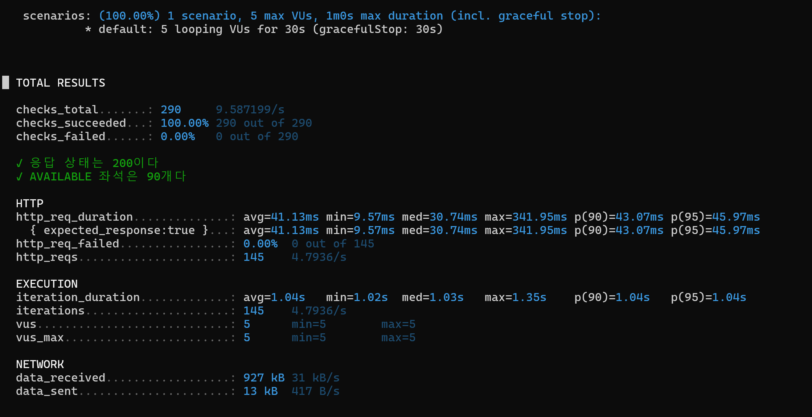
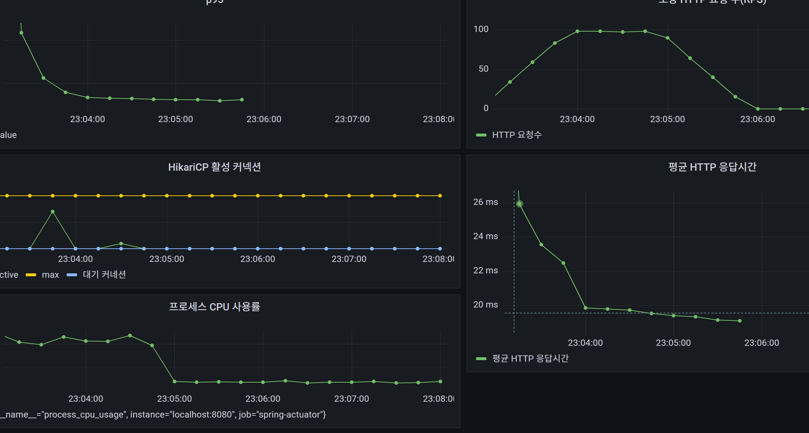
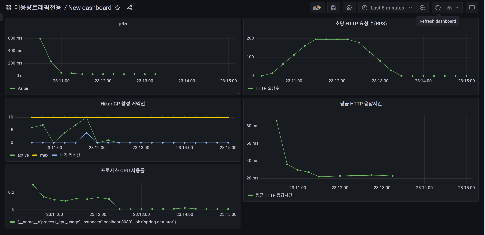
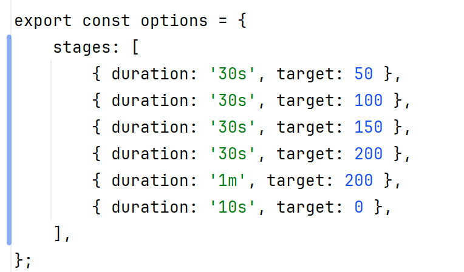
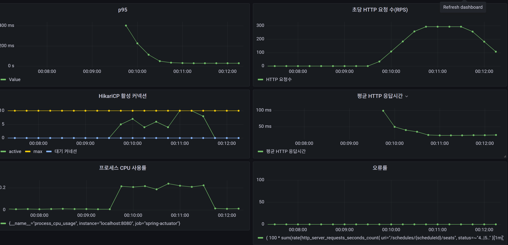

# 좌석 조회 API 부하 테스트 기준선 (형식)

## V2: 작은 Load Test

## 테스트 목적

회차별 예약 가능 좌석 조회 API의 초기 성능을 측정하고,
이후 부하 증가 및 성능 개선 결과와 비교할 기준선을 만든다.

## 테스트 환경

- API: `GET /schedules/1/seats`
- ScheduleSeat: 10,000개
- API 반환 좌석: AVAILABLE 90개
- 인덱스: `(schedule_id, status)`
- 실행 위치: Spring Boot와 k6를 동일 PC에서 실행
- SQL 로그: 활성화
- k6 스크립트: `k6/seat-read-load.js`

## 테스트 조건

- VU: 5
- 실행 시간: 10초
- Think time: 1초
- 응답 검사:
    - HTTP 상태 200
    - AVAILABLE 좌석 90개

## 결과

| 요청 수 | RPS | 평균 | 중앙값 | p95 | 최대 | 실패율 |
|---:|---:|---:|---:|---:|---:|---:|
| 50 | 4.64 | 73.9ms | 58.67ms | 161.69ms | 167.34ms | 0% |

## 분석

- 요청 50개와 검사 100개가 모두 성공했다.
- VU 5명이 요청 후 1초씩 대기하여 약 4.64 RPS가 발생했다.
- 평균 응답시간보다 p95가 약 2배 높아 느린 요청이 일부 존재했다.
- SQL 로그가 활성화돼 있어 공식 성능 기준선으로 사용하기에는 로그 출력 비용이 포함돼 있다.

## 다음 실험

- SQL 로그 비활성화
- 실행 시간을 30초 이상으로 증가
- 동일 조건으로 정식 기준선 재측정
- 이후 VU를 단계적으로 증가해 서버 한계 확인
---- 

## V3: sql 활성화 3번 비활성화 3번 성능 비교 

- 본 측정 전 smoke test를 1회 실행하여 JVM, DB 연결 및 캐시를 예열한 후 load test를 수행했다.
  - 예열 하는이유 : 서버를 처음 실행했을 때만 발생하는 준비 비용을 본 측정에서 제외하기 위해 필요합니다.
    - 서버 시작 직후 첫 요청에서는 다음 작업들이 함께 발생할 수 있습니다.
    - JVM이 자주 실행되는 코드를 JIT 컴파일
    - Spring/Hibernate가 처음 사용하는 코드와 쿼리를 준비
    - HikariCP가 DB 연결을 준비
    - MySQL이 디스크에서 읽은 데이터와 인덱스 페이지를 Buffer Pool에 적재
    - 운영체제가 파일 데이터를 캐시에 적재
  - 결론 
  - 예열 없음:
    첫 실행 준비 비용 + 실제 API 처리시간
  - 예열 후:
    평소 상태의 실제 API 처리시간에 가까움

## 테스트 환경

- API: `GET /schedules/1/seats`
- ScheduleSeat: 10,000개
- API 반환 좌석: AVAILABLE 90개
- 인덱스: `(schedule_id, status)`
- 실행 위치: Spring Boot와 k6를 동일 PC에서 실행
- SQL 로그: 비활성화 vs 활성화 
- k6 스크립트: `k6/seat-read-load.js`

## 테스트 조건

- VU: 5
- 실행 시간: 30초
- Think time: 1초
- 응답 검사:
  - HTTP 상태 200
  - AVAILABLE 좌석 90개

## 결과

| 실험 |     요청 수 |    RPS |            평균 |     중앙값 |     p95 |      최대 | 실패율 | sql 여부 |
|---:|---------:|-------:|--------------:|--------:|--------:|--------:|----:|-------:|
|  1 |      145 |  4.8/s |       34.99ms | 38.38ms | 86.37ms | 97.85ms  |  0% |      O |
|  2 |      145 |  4.8/s |       35.73ms | 32.04ms |56.89ms |105.89ms |     0.00%   |      x |
|  3 |      145 |  4.8/s |       38.09ms | 36.77ms |58.57ms | 100.11ms |     0.00%   |      O |
|  4 |      150 | 4.84/s |       30.66ms |   27.52ms       |55.65ms |59.79ms |   0.00%  |      x |
|  5 |      145 | 4.79/s |     41.59ms          |  38.44ms        |62.57ms | 104.45ms|    0.00%  |      O |
|  6 |     145  |  4.8/s |    38.7ms           |    37.75ms      | 64.62ms|91.67ms  |  0.00%     |      x |

- 정리

VU 5, Think time 1초의 낮은 부하에서는 SQL 로그 활성화 여부에 따른 뚜렷한 성능 차이가 나타나지 않았다. SQL 로그를 비활성화했을 때 평균과 p95가 소폭 감소했지만, 실행별 편차보다 차이가 작고 RPS와 실패율도 동일하여 유의미한 개선으로 판단하기 어렵다.

이유는 현재 sleep(1) 때문에 RPS가 약 5로 제한되어 콘솔 출력이 병목이 될 만큼 요청이 많지 않기 때문입니다. 나중에 VU를 높이고 Think time을 줄인 테스트에서는 차이가 커질 수 있습니다.

- VU 100 / 2m
- 약 100 RPS
- 평균 응답시간: 약 19ms
- p95: 약 23~30ms
- CPU: 약 5~7%
- HikariCP active: 순간 최대 5
- 실패 여부: 없음
- 결론: 병목 미발견, 다음 VU 200

- VU 200 / 2m
- RPS: 안정 구간 약 190 RPS
- 평균 응답시간: 초기 86ms 이후 약 22ms
- p95: 초기 약 600ms 이후 빠르게 안정
- CPU: 초기 약 30%, 안정 구간 약 10~15%
- HikariCP 최대 커넥션: 10
- 활성 커넥션: 순간적으로 10 도달
- 대기 요청: 순간적으로 4 발생

이번엔 점진 적인 부하 시도 
- VU 200 / 2m
- 최종 약 190 RPS
- 평균 응답시간 약 16~23ms
- p95 약 22~31ms
- HikariCP active가 점진적으로 증가
- 오류율 0%
- pending은 순간 최대 1

### 결론  

- 순간 VU 200   
시작 p95 약 600ms    
평균 응답시간 초기 약 86ms   
HikariCP active=10  
pending=4  
이후 약 190 RPS로 안정화  

- 점진 VU 200    
p95 약 22~31ms  
평균 응답시간 약 16~23ms  
HikariCP active가 점진적으로 증가  
pending은 순간 최대 1  
오류율 0%  
최종 약 190 RPS  

-> 서버는 200 VU의 지속 부하는 안정적으로 처리하지만, 200 VU가 동시에 시작하는 순간 폭주에는 일시적인 지연이 생길 수 있다는 인사이트입니다.

300VU / 2m 결과

