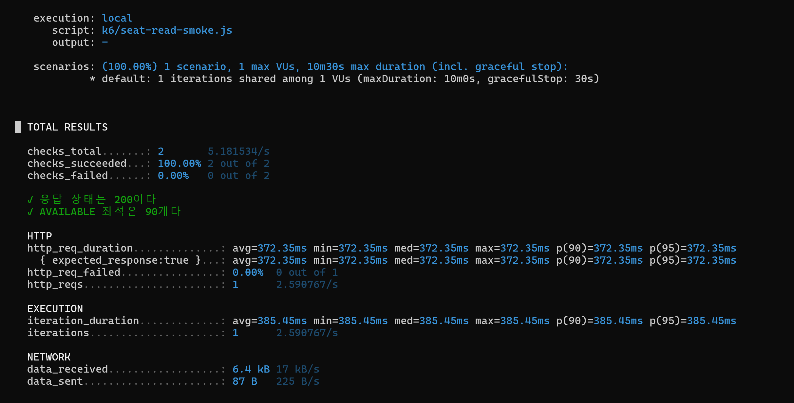
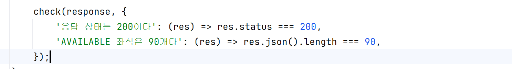

# 알게된 내용
- Chocolatey, 줄여서 choco는 Windows용 프로그램 설치 관리자

- execution : local -> 내컴퓨터에서 k6를 실행했다는 뜻
- script: k6/seat-read-smoke.js -> 실행한 스크립트 파일
- output: -    -> 결과를 Grafana나 파일로 전송하지 않고 터미널에만 표시
- scenarios:
  - 1 scenario -> 사용자 행동 시나리오
  - 1 max VUs -> 가상 사용자
  - 1 iterations shared among 1 VUs -> default function 전체 실행 횟수
- 10m30s max duration -> 아무리 오래 걸려도 최대 이 정도까지만 허용
  - maxDuration: 최대 10분
  - gracefulStop: 추가 최대 30초 -> 종료 시 정리 시간

- checks_succeeded: 100%, 2 out of 2 : check부분이 다맞아서 성공
- checks_failed: 0%, 0 out of 2

##### 주의할 점은 check가 실패해도 기본적으로 k6 실행은 계속된다는 것입니다. 나중에 threshold를 붙여야 테스트 전체를 실패 처리할 수 있습니다.

- HTTP
  - http_req_duration 
    - avg=372.35ms -> 평균
    - min=372.35ms -> 가장 빠른 요청
    - med=372.35ms -> 중앙값
    - max=372.35ms -> 가장 느린 요청 
    - p(90)=372.35ms -> 요청의 90%가 이 시간 이하 -> 여기서 이하란게 빨랐단느뜻 
    - p(95)=372.35ms -> 요청의 95%가 이 시간 이하 -> 그리고 지금은 요청이 하나라서 모든 수치가 같음 

- { expected_response:true }   
k6가 성공 응답으로 판단한 요청만 따로 계산한 값입니다. 기본적으로 HTTP 200~399 응답을 성공

- http_req_failed: 0.00%, 0 out of 1 -> 실패한 HTTP 요청 

- http_reqs: 1, 2.590767/s  
  - 1 -> HTTP 요청 총개수 
  - 2.59/s  -> 전체 테스트 시간을 기준으로 환산한 초당 요청 수

- iteration_duration: 385.45ms -> default function 전체 실행 시간
  - +  HTTP 요청
  - + check 실행
  - + JavaScript 처리
  - + sleep이 있다면 sleep 시간
  - 그래서 HTTP 요청 시간 372.35ms보다 약간 큼

### iterations
- iterations: 1
  - default function을 한 번 실행했다는 뜻
    - 한 iteration 안에서 HTTP 요청을 세 번 작성하면:
      - iterations = 1
      - http_reqs = 3  따라서 iteration과 HTTP 요청 수는 항상 같지는 않습니다.

  
### Network
 - data_received: 6.4KB
   - 서버에서 받은 전체 데이터입니다. 
   - 좌석 90개의 JSON과 HTTP 헤더가 포함됩니다.
 - data_sent: 87B
   - 서버에 보낸 요청 데이터입니다.
   - 현재 GET 요청이라 전송량이 작습니다.

## 우선 볼 지표 

1. checks_succeeded
→ 응답 내용이 정확한가?

2. http_req_failed
→ 요청 실패율은 얼마인가?

3. http_req_duration의 p95
→ 대부분의 사용자가 얼마나 기다리는가?

4. http_reqs의 초당 수치
→ 서버가 초당 몇 요청을 처리했는가?

ex )
- p95 증가  
→ CPU가 부족한가?  
→ Tomcat 스레드가 찼는가?   
→ DB 커넥션이 부족한가?  
→ 락 대기가 발생했는가?  

RPS : Requests Per Second, 즉 서버가 초당 처리한 HTTP 요청 수

