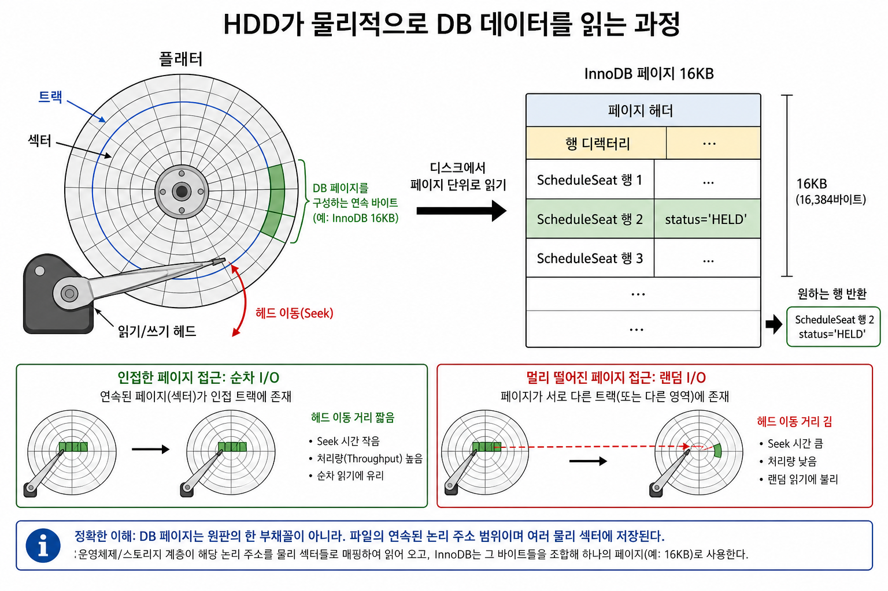
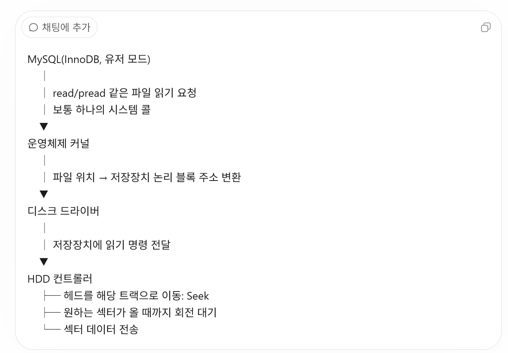
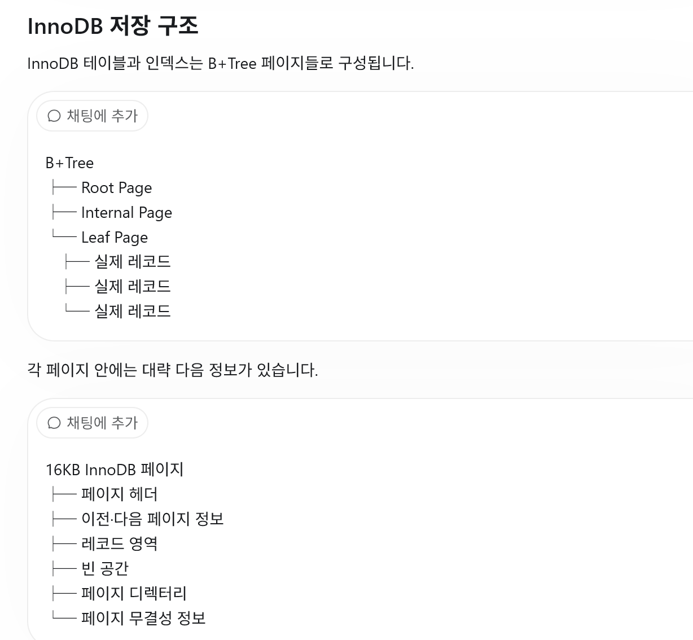
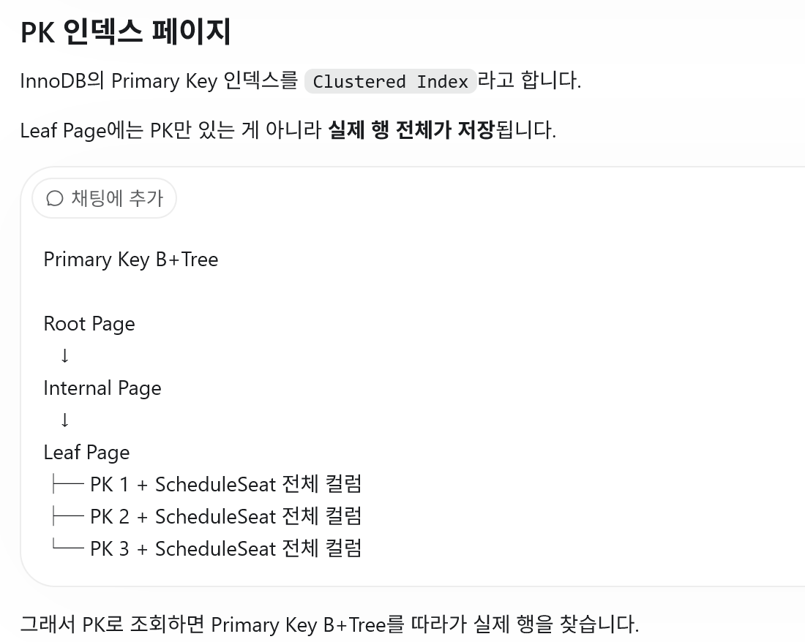
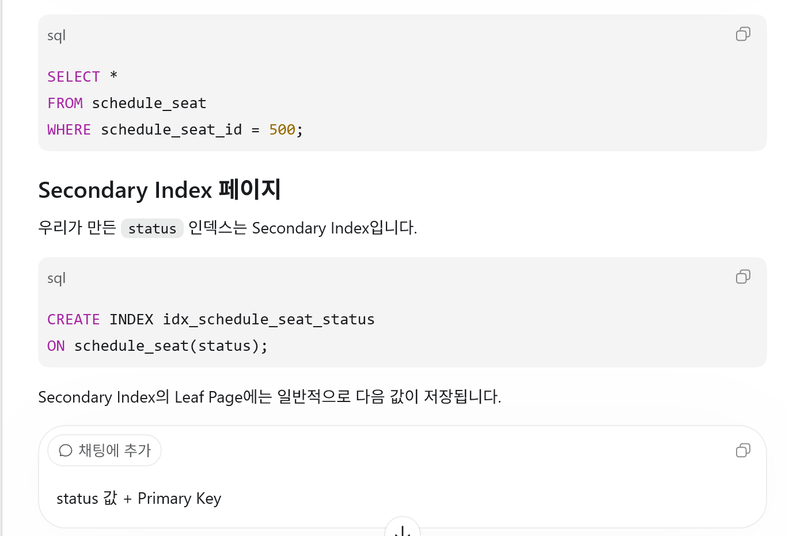
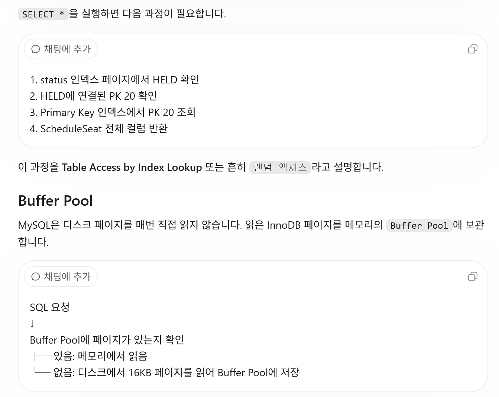
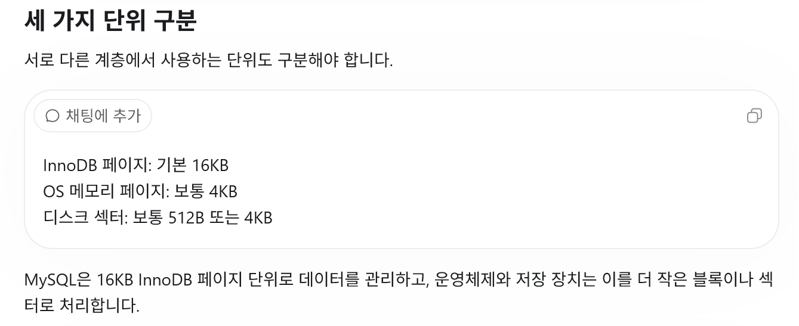
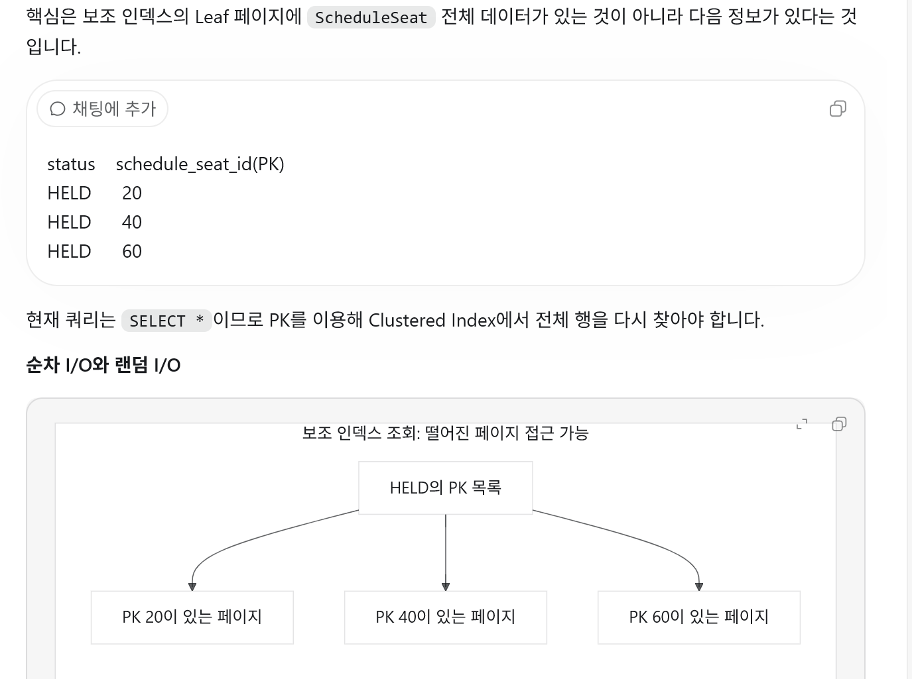

# 인덱스의 랜덤, 순차 Input/Output 

여러 섹터 → DB 페이지 하나    
DB 페이지 하나 → 일반적으로 여러 행

#### 랜덤 I/O

디스크에서 접근하려는 데이터의 위치가 연속되지 않고 서로 떨어져 있는 I/O 방식이다.
여기서 랜덤은 값을 무작위로 찾는다는 뜻이 아니라, 접근 주소가 순차적이지 않다는 뜻이다.

100번 페이지 (시스템콜 3번)  
→ 800번 페이지
→ 35번 페이지
→ 1200번 페이지

#### 순차 I/O

디스크에서 논리적으로 연속된 위치의 데이터를 차례대로 읽거나 쓰는 I/O 방식이다.

100번 페이지 (시스템콜 1번)   
→ 101번 페이지
→ 102번 페이지
→ 103번 페이지

##### 패이지란??? 
DB에서 말하는 **페이지(Page)**는 데이터를 디스크에서 읽고 쓰는 기본 묶음 단위입니다.     
MySQL InnoDB의 기본 페이지 크기는 16KB입니다.     

---
##### 행과 페이지 관계
ScheduleSeat 한 행을 읽더라도 디스크에서 그 행의 몇 바이트만 읽는 것이 아닙니다. 해당 행이 포함된 16KB 페이지 전체를 읽습니다.    
ScheduleSeat 행 1개 필요   
↓  
행이 들어 있는 페이지 확인   
↓   
16KB 페이지 전체 읽기     
↓    
페이지 안에서 원하는 행 찾기   

---

// 인덱스에대한 설명 // 

---

결국 PK로 다시접근해서 검색하네? 보조 인덱스로 검색해서 PK들을 조회한다음 다시 PK로 객체들을 다시찾는과정이네? 

---

#### 항상 index가 빠른것은 아니다??!
ex)   
현재 인덱스 조회와 연결    
현재 status 인덱스는 대략 다음 정보를 가지고 있습니다.   
HELD → PK 20   
HELD → PK 40   
HELD → PK 60

SELECT *이므로 인덱스에서 PK만 찾는 것으로 끝나지 않습니다.   
실제 ScheduleSeat의 모든 컬럼을 가져와야 합니다.   
status 인덱스에서 HELD의 PK 확인   
→ PK 20의 실제 테이블 페이지 조회   
→ PK 40의 실제 테이블 페이지 조회   
→ PK 60의 실제 테이블 페이지 조회  
실제 행들이 서로 다른 페이지에 흩어져 있다면 여러 페이지를 오가므로 Random I/O가 발생할 수 있습니다.   
인덱스가 항상 빠르지 않은 이유   
HELD가 500개라면:    
인덱스 탐색
+ 실제 테이블 행 최대 500개 조회   
  가 전체 10,000행 순차 스캔보다 유리할 수 있습니다.  
  하지만 AVAILABLE이 9,000개라면:   
  인덱스 탐색
+ 실제 테이블 행 최대 9,000개 조회    
  처럼 많은 Random I/O가 발생할 수 있습니다. 이때는 MySQL이 다음처럼 판단할 수 있습니다.
  인덱스로 9,000번 위치를 찾아가는 것보다   
  테이블 10,000개를 처음부터 순서대로 읽는 것이 더 빠르다.   
  그래서 데이터 조회 비율이 높으면 인덱스가 있어도 Table Scan을 선택할 수 있습니다.   

##### SSD에서는? (웨이는 HDD)
SSD에는 물리적인 디스크 헤드가 없습니다.    
따라서 HDD보다 Random I/O 부담이 훨씬 작습니다.            
그래도:    
연속 데이터를 한 번에 읽는 작업   
흩어진 페이지를 여러 번 요청하는 작업   
사이에는 컨트롤러 처리, 요청 횟수, IOPS 등의 차이가 있으므로 SSD에서도 순차 I/O가 일반적으로 더 효율적입니다.

---

현재 10,000건 테스트는 데이터가 작아서 대부분 MySQL Buffer Pool 메모리에 있을 가능성이 큽니다.       
현재 측정 시간은 실제 물리 디스크 헤드 이동보다는 메모리에 캐시된 DB 페이지 접근과 조건 처리 시간에 가까울 수 있습니다.    
