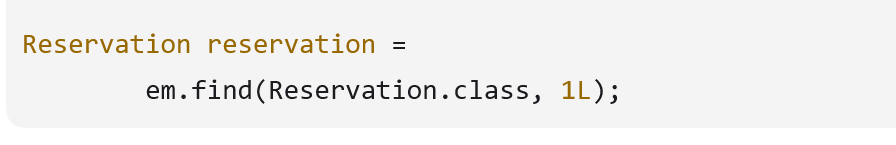
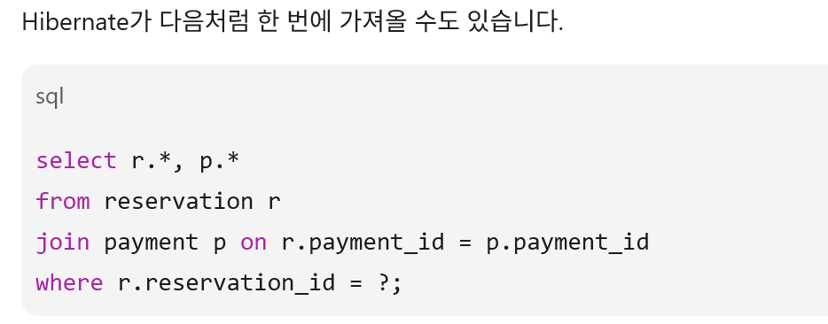
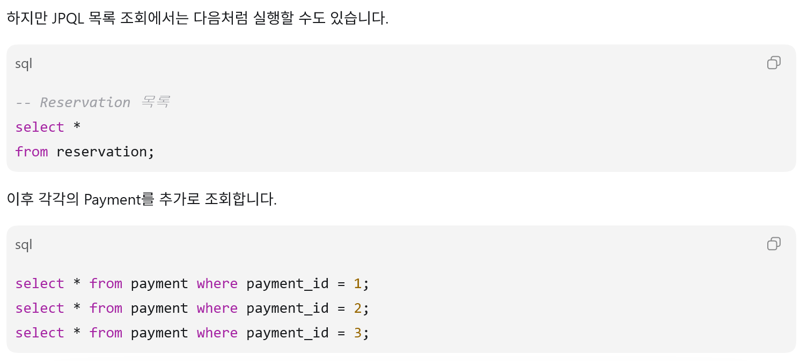
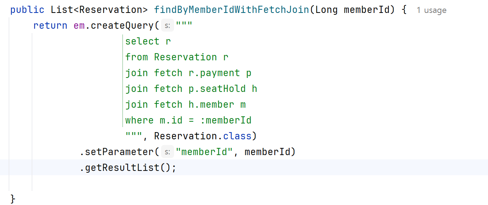

# Eager Vs Fetch join
공부하다가 두개 똑같은거 아님? 둘다 미리 -> 데이터 가져오는거아님?   
진짜일까? 알아보자 ~     
###### (+ TMI : JPA : 자바에서 관계형 DB를 사용하는 규칙과 표준 인터페이스 
######  Hibernate : JPA 규칙을 실제로 구현한 구현체)

- EAGER/LAZY: 엔티티의 기본 로딩 정책    
- Fetch Join: 특정 조회에서 연관 엔티티까지 가져오라는 쿼리 명령

-----
#### EAGER가 SQL Join을 보장하지 않는다는 점

##### 2가지의 경우로 쿼리가 나갈수도있음(JPQL없이 엔티티 조회했을경우)

JPQL 없이 엔티티를 조회해도 Hibernate가 매핑 정보를 보고 
SQL을 만들며, 연관 엔티티를 JOIN 또는 추가 SELECT 방식으로 가져올 수 있다”**

이게 첫번쨰 경우 (조인을 한 경우) 

이게 두번쨰 경우()

EAGER에서도 N+1 가능함 

---------- 
#### JPQL에 fetch조인을 명시한경우
