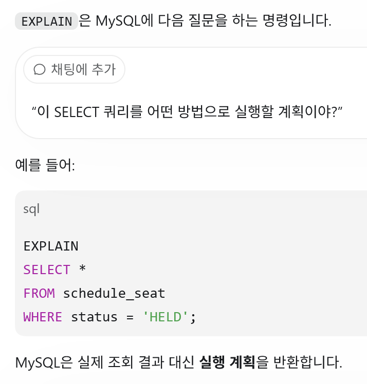
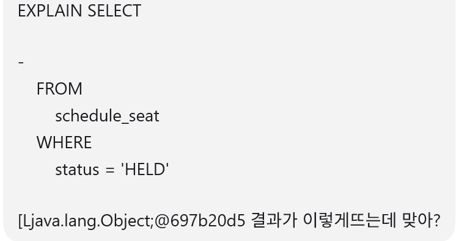
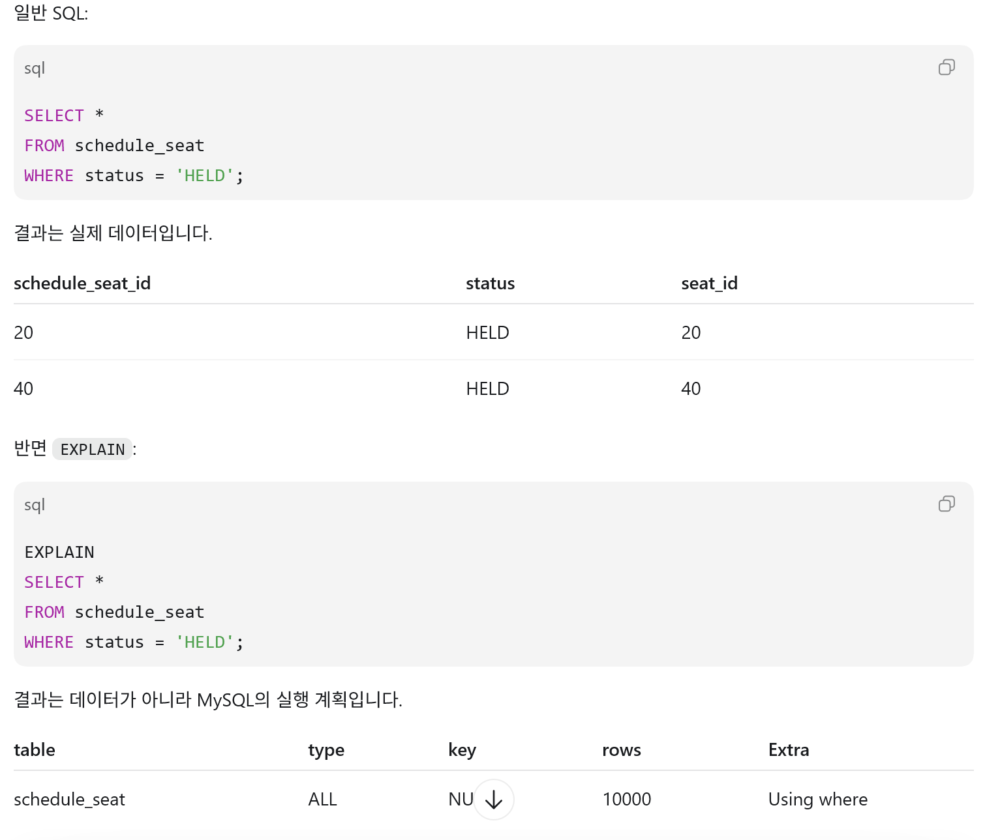
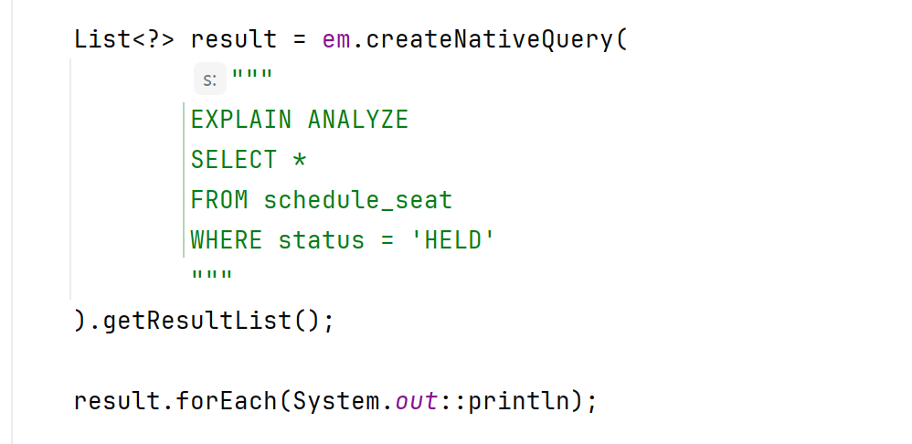
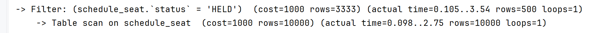
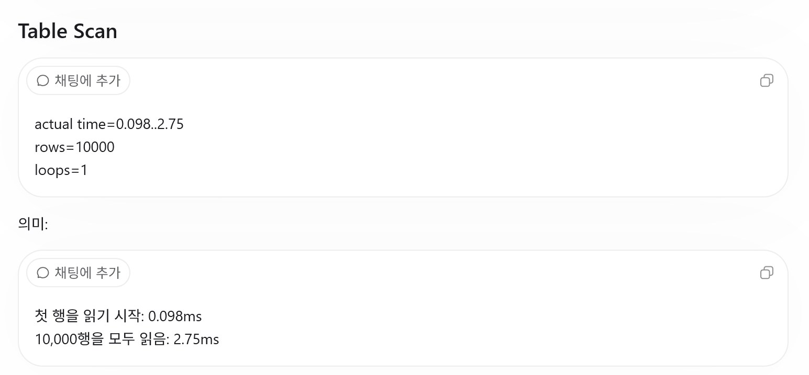

.

실제 하이버네이트는 이렇게 SQL   
->   
여기서 의문점 그냥 jpql를 sql로 쓴거아니야? 

차이점을 알아보자  

그렇다 맨위에대한 결과가 객체@해쉬값이 나오는이유가 바로 그거다  
저걸 객체로 실행계획을 써놓으것 

#### explain analzy를 사용한 이후  

#### 2개의 문장이 떳다 해석해보자면 

-----
첫번쨰로 먼저 

으로 스캔을 먼저함 
조건검사로 스캔한거기반해서 결과를 산출

전체 스캔후 2.75ms 
합쳐서 조건 필터링까지 3.56ms걸렸다 
여기서 예측행으로 3333이 나왔는데
이것은 상태값이 3개라 3333으로 나왔다  ->   
하지만 5%라서 500개밖에안나옴 

