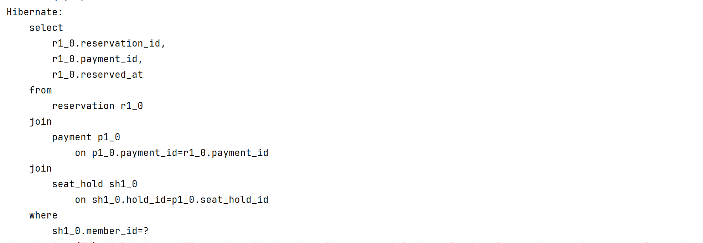
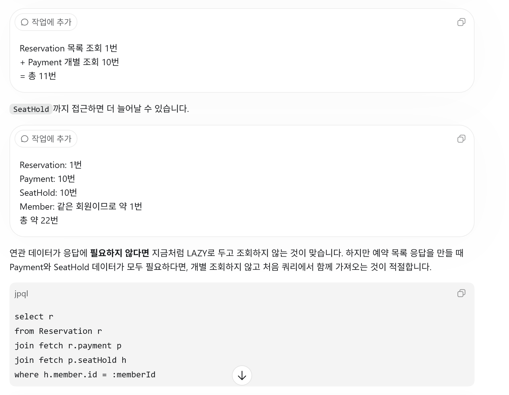
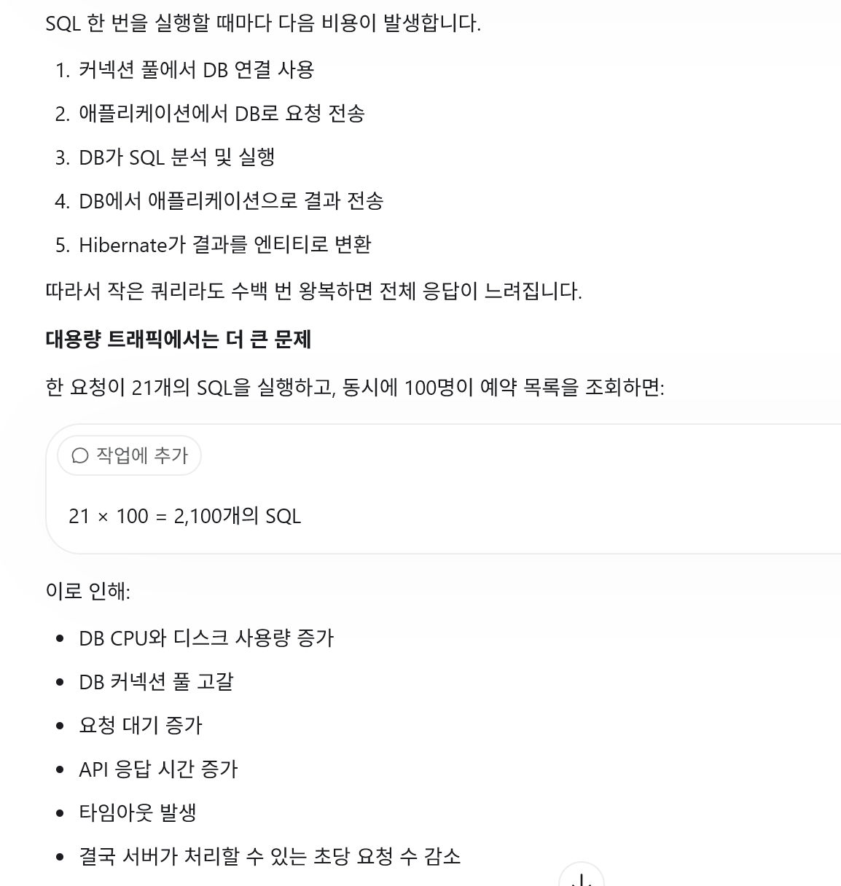
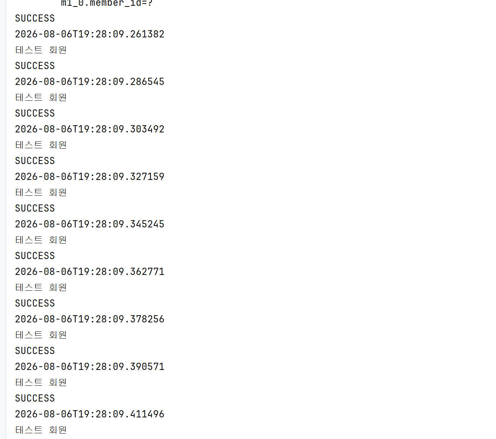
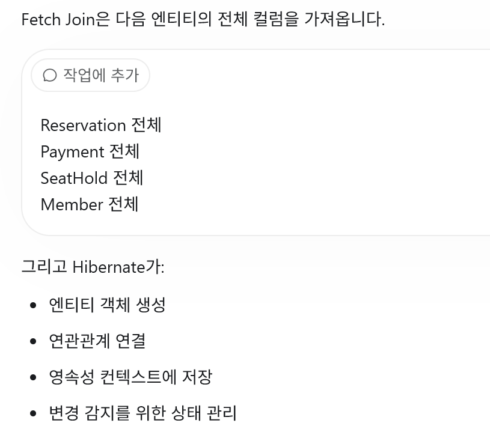
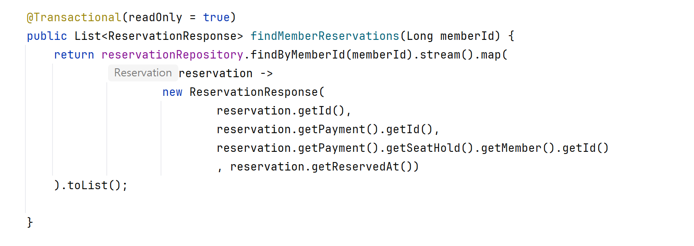
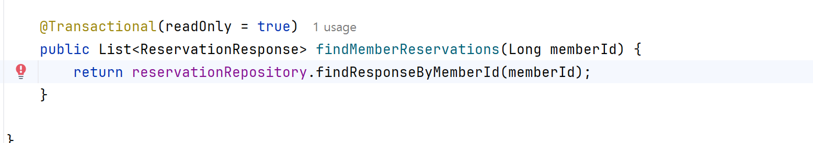

## 0단계: 연관 엔티티를 LAZY로 설정

연관 엔티티를 LAZY로 설정하면 처음부터 실제 엔티티 전체를 조회하지 않고,
해당 연관관계에는 초기화되지 않은 프록시 객체가 들어간다.

프록시는 연관 엔티티의 ID는 알고 있지만,
paymentStatus 같은 일반 필드는 아직 조회하지 않은 상태다.

이후 일반 필드에 접근하면 Hibernate가 추가 SELECT 쿼리를 실행하여
실제 엔티티를 조회하고 프록시를 초기화한다.

## 주의: LazyInitializationException

처음 실험할 때 조회와 연관관계 접근을 묶는 트랜잭션을 사용하지 않았다.

Reservation 조회가 끝난 뒤 영속성 컨텍스트(Session)가 유지되지 않는 상태에서
LAZY 프록시의 실제 데이터에 접근하여 LazyInitializationException이 발생했다.

트랜잭션 시작   
↓      
Reservation 조회      
↓      
트랜잭션 종료 또는 Session 닫힘    
↓ 
reservation.getPayment().getPaymentStatus()   
↓   
Payment 프록시 초기화 시도   
↓  
사용 가능한 Session 없음   
↓  
LazyInitializationException   

따라서 조회와 LAZY 연관관계 접근은 같은 트랜잭션 안에서 실행해야 한다.

## 1단계: 연관 엔티티 접근으로 N+1 문제 발생

문제 정의:

최초 목록 조회 쿼리 1번으로 Reservation N개를 가져온 뒤,
반복문에서 각 Reservation의 연관 엔티티에 접근하면서
추가 SELECT 쿼리가 N번 발생하는 문제다.

예를 들어 Reservation 10개를 조회하고 각각의 Payment 상태를 사용하면:

즉, N + 1개의 쿼리가 실행된다.   
-> 이게 why? 문제가 되나?? 필요한건만 가져오면 괜찮은거 아닌가? 

##### 이유 : DB와 애플리케이션 사이의 통신 횟수가 데이터 개수에 따라 계속 증가하기 때문

4가지의 해결방법있음    

1. fetch join
2. DTO 직접 조회
3. Batch Fetch
내일은 fetch join을 배울거임 

1. fetch join으로 추가 query가 안나감 그로인해  DB에 쿼리를 1번으로 DB에게 영향을 많이주지않음 

2.현재 예약 목록처럼 ID와 예약 시간만 반환하는 조회 전용 API에는 DTO 직접 조회가 더 가볍습니다.
 fetch에 비해 더가벼움 
결과는 위와(1번) 동일하게 나옴 

-> 

리펙토링에도 효과적임 

-------
# 결론
   일반 Join
- SQL 여러 번
- N+1 발생

Fetch Join
- SQL 1번
- 연관 엔티티 전체 컬럼 조회
- 엔티티가 영속성 컨텍스트에서 관리됨

DTO 직접 조회
- SQL 1번
- 필요한 4개 컬럼만 조회
- 엔티티와 프록시를 생성하지 않음
- 조회 전용 API에 최종 적용