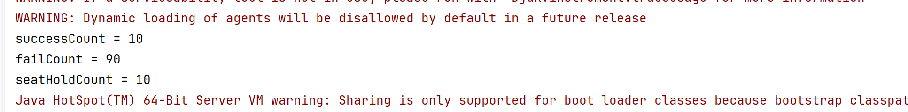

# 락 적용 전 동시성 문제 재현

## 테스트 조건
- 요청 수: 100
- 대상 좌석: 동일한 scheduleSeatId
- 락 적용: 없음
- 실행 방식: ExecutorService + CountDownLatch

## 결과
- 성공 수: 10
- 실패 수: 90
- SeatHold 생성 수: 10

- 
## 원인
여러 스레드가 동시에 같은 좌석 상태를 AVAILABLE로 조회했다.
각 스레드는 자신이 조회한 시점에는 선점 가능하다고 판단했고,
트랜잭션 커밋 전후 타이밍 차이 때문에 여러 SeatHold가 생성됐다.

## 결론
현재 구조에서는 같은 좌석에 대해 여러 선점이 성공할 수 있다.
따라서 ScheduleSeat 조회 또는 상태 변경 구간에 동시성 제어가 필요하다.