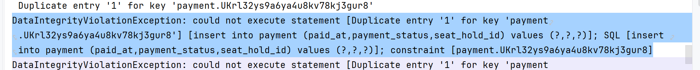
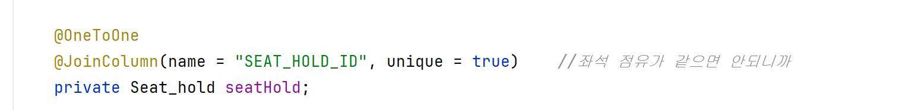
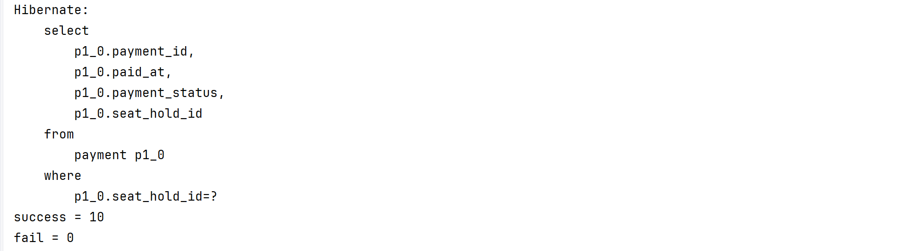

#### 중복방지란

같은 데이터가 들어올려는것을 방지하는것임

#### 멱등성 
같은 요청이와도 똑같은 결과가 나와야함 

### 중복 결제는 어떻게할것인가?

##### 상황 : 실수로 주문 버튼을 2번 누른상황 그리하여 주문 요청이 2번들어갔음 

중복 방지:   
-> 1.첫번째 요청 성공 , 2. 두번째 요청 실패 에러 답변 

 ->DataIntegrityViolationException 에러내뱉음 

  
멱등성 : 
-> 1. 첫번째 요청 DTO 반환, 두번째 요청 똑같은 DTO 반환  

- 손님이 에러를 받으면 결제실패라고 판단가능 그리하여 멱등성이 더 결제 API에 맞다고 판단 

seatHold에 findByIdWithPessimisticLock으로 조회하면서 락을걸어
이 트랜젝션이  끝날떄까지 lock을 할당받아 다른 쓰레드가 대기시킴
그리하여 동시 쓰레드가 접근하기 못하고 하나의 쓰레드만 접근가능 
    
-> 정리   
  중복 방지:  
unique를 붙여 DB가 중복 에러를 나게하여 중복을 방지하는 동시에 
에러를 나게하여 실패 9, 성공 1를 기록함 

멱등성 :   
에러로 접근하기 전에 기존에 findByWithPessimisticLock으로
해당 Id에대해 동시접근 막아버려서 다른 쓰레드는 대기하게하고
조회 자체를 막아버림 그리하여  대기하게하여 새로운정보를 기록후
트랜잭션이 커밋한이후 다른 쓰레드가 락을 얻어 조회한이후 
create에 접근하기전에 DTO로 리턴 하여 에러나는것을 방지함 
그리하여 실패 0, 성공 10를 기록함 
