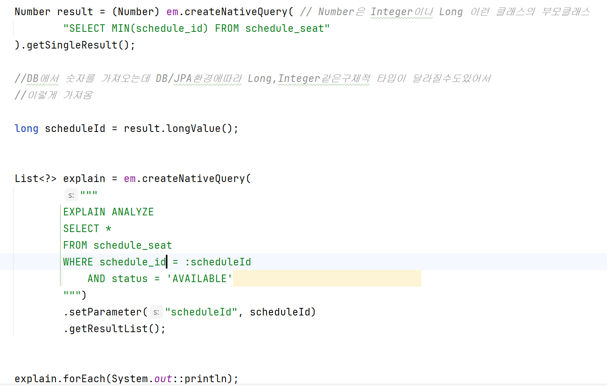
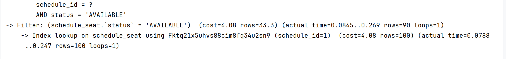
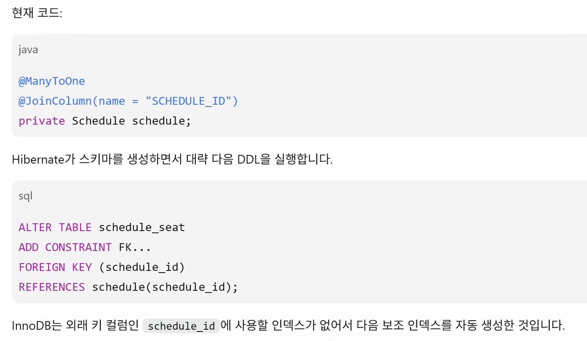
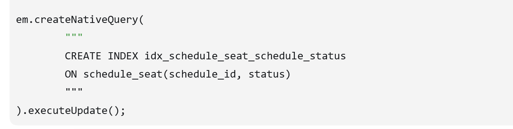
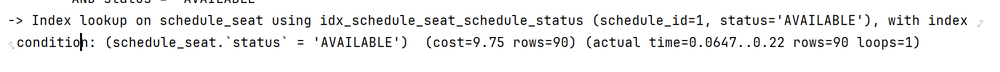
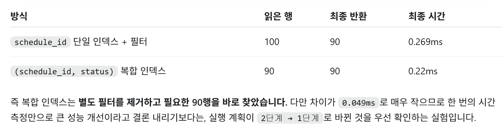
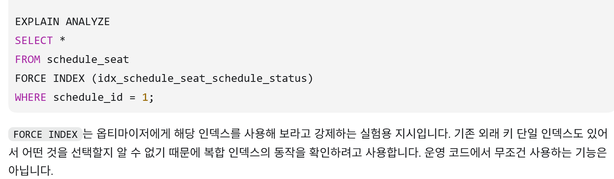
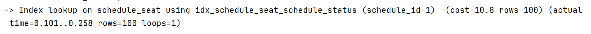
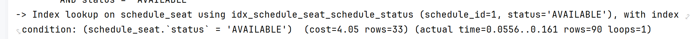
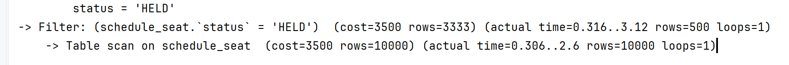

# 복합인덱스비교 

- 비교에 들어가기전에 신기한 것(내 기준)을 발견

여기서 보면 인덱스를 만들지 않았는데 자동으로 인덱스가
만들어진 것을 알 수 있다

1. FK 단일 인덱스로 schedule_id=1 검색
   → 100행 조회

2. 조회한 100행에서 status='AVAILABLE' 검사
   → 90행만 반환

# 왜 만들어 졌는가? 

Hibernate  
→ FOREIGN KEY 생성 SQL 전달   

InnoDB   
→ 외래 키를 지원할 인덱스가 있는지 확인   
→ 없으면 인덱스 자동 생성  

InnoDB(스토로지 엔진)는 외래 키 검사를 효율적으로 하기 위해 
필요한 인덱스가 없으면 자동으로 생성할 수 있습니다.
만드는 방식은 보조 인덱스 만드는 방식과 같다
=> 처음부터 2개의 인덱스 B+tree가있는거임 

---- 
# 복합 인덱스 

여기서 궁금한점이 외부키에 접근했으니까 이떄 보조 인덱스가 만들어지나? 생각을 했지만 
위에 글을 보면 알수있다 

0.269ms -> 0.22ms 로 복합인덱스가 더빨랐다 

복한 인덱스는 1단계에서 끝냈지만   
단일 인덱스는 id 조회 ->  fittering까지해서 2단계가 걸렷다. 

## 장점만 있는건 아니다! 
#### 복합 인덱스에는 규칙있다 -> 왼쪽 우선 규칙 (Leftmost Prefix Rule)
(schedule_id, status) 2가지 컬럼은 B+tree로 같이  보조인덱스 역할을 해야하기에
왼쪽부터 순서대로 묶여서 저장하기 시작함

먼저 schedule_id로 정렬을 하고 그 안에서 status로 정렬을 함 

status를 조회하면 각각 떨어져있어서 효율적으로 사용불가하다    

----
정리       
인덱스: (schedule_id, status)       

schedule_id                  사용 가능     
schedule_id + status         사용 가능     
status                       일반적으로 효율적 사용 불가    

FORCE INDEX : 지정한 인덱스를 현재 조건에 사용할 수 있다면 우선 사용
→ 사용할 수 없으면 Full Scan

schedule_id -> 0.258ms(Index)

schedule_id + status  -> 0.161ms (Index)

status  -> 3.12ms  (FullScan)

