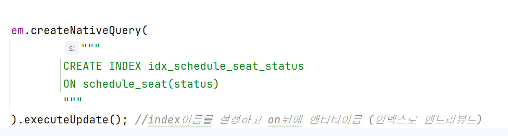
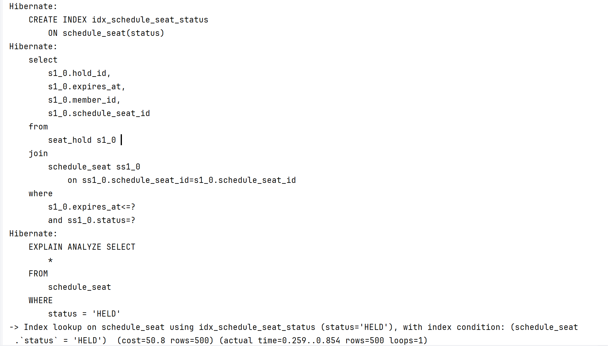
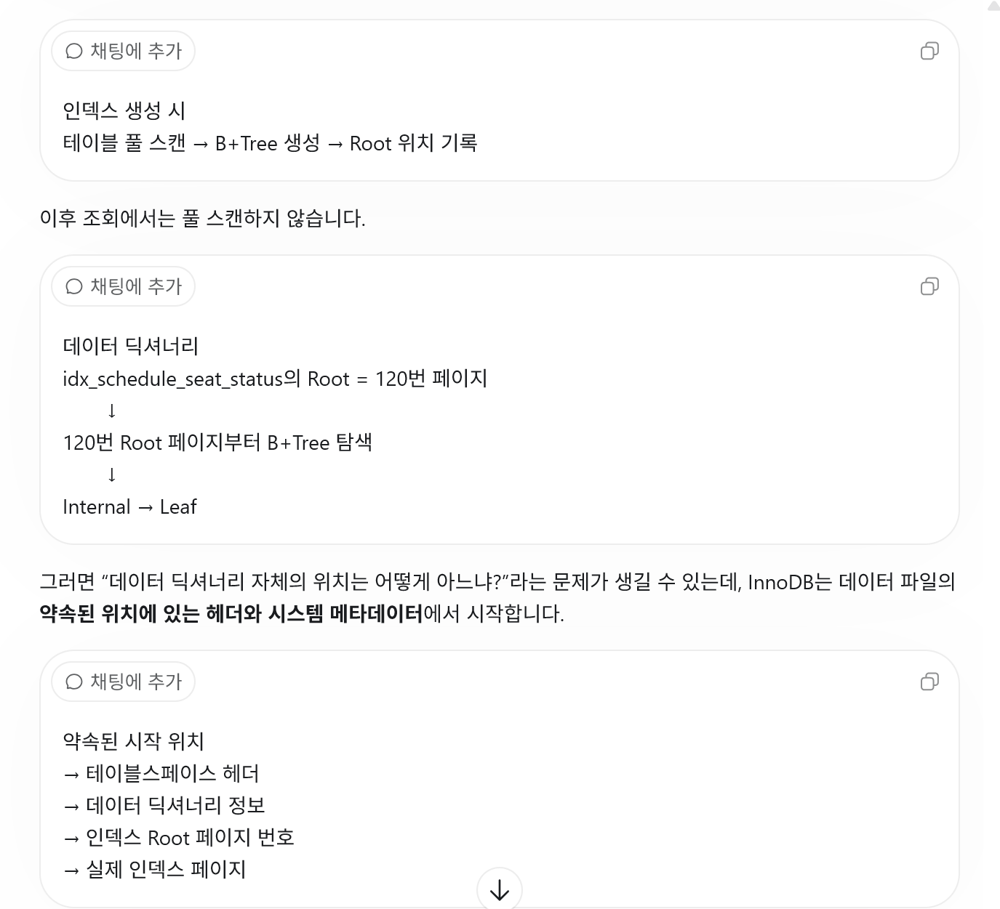
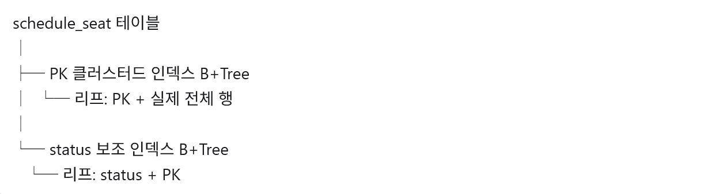
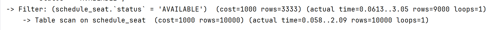
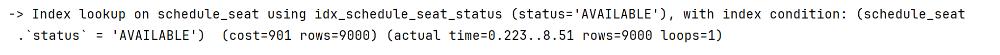

#  인덱스 적용 전후 조회 성능 비교

#### 인덱스 적용전 

1번 스캔하는 하고 필터까지 걸린 시간   
=  3.54ms 

#### 인덱스 적용 후 

0.854ms로 대략 4배정도 시간이 단축됐다

#### 여기서 궁금한점! 해당 인덱스들이 어디있는지는 어케 알까?
인덱스가 없을때는 다 스캔해서아니까 그렇다 치고 그럼 index은 어디에있는지 표기를해서 바로바로 찾아간다는건알겠어
그럼 그표기를 할때는 결국 풀스캔해야하는거 아니야? -> 그렇다! 처음에는 

위에 표기된초는 인덱스를 생성한 후(부 인덱스에 B+tree)가 만들어진이후)의 조회한시간이다!!

---
나는 지금 Mysql를 쓰고있고 여기서 우리가쓰고있는   
InnoDB으로 스토리지 엔진을 쓰고있다 

스토리지 엔진은 데이터를 실제로 다음과 같이 관리합니다.   
데이터를 파일과 페이지에 저장   
1. B+Tree 인덱스 관리    
2. 행 검색 및 변경      
3. 트랜잭션 처리
4. 락과 동시성 제어
5. 장애 복구   
6. Buffer Pool 관리   

이것을 언급하는이유:   
인덱스가 어떻게 작동하는지에대한 작동 방식을 설명하기위해서이다   
index를 우리가 만들었기때문이다     
InnoDB은 위에 6가지를 관리하고 
index가 아예없는건아니다 기존에  PK라는 것으로 쓰고있었다    
지금 우리가 status로 Secondary index로 만들었다
Clustered index은 우리가 기존에 pk를  칭한다

(여기서의 fullscan은 기존의 B+tree에서의 fullscan임, 그리고 기존의 B+tree은 데이터가 들어오면서 생기는거라 ㄱㅊ)
index를 설정하면 status+ 기존 PK 으로 B+tree 가만들어진다 
그래서 이제 인덱스를 만들고 검색을 하게되면 
인덱스로 검색을 하게 되면 먼저 보조인덱스 B+tree로 가서 PK들을 찾고
-> 원본 클러스트 인덱스 B+tree로 간다 

--------- 
#### 그럼 인덱스를 무조건쓰는게 좋은가? -> 그건 아니다 

- Fullsan이 더 좋은 경우가있다

  1. 조건에 맞는 경우가 대부분일경우이다. (많은양을 가진 인덱스 실험 결과, 옵티마이저 선택한것 : 비용이 덜드는쪽을 예측해서함) 
    
  10000개중 9000개에 해당하는 값을 조회한경우다   
     많은양의 인덱스보다 많은양의 풀스캔이 더빨랐다
     1. 8.51ms(많은양을가진 인덱스) > 3.56ms(fullsan(적은양))>3.06ms(fullscan(많은양) > 0.854ms(적은양의 인덱스)
        

tmi + ) actual 왼쪽 보면 값들이있는데 저건 옵티마이저가 예측해서 값을 내놓는것임

2. 한번 조회할려고 인덱스를 새로 만드는 경우 
-> 인덱스 생성비용 + 조회비용 으로 그냥   풀스캔 한번이 더나을수도있음
----- 

