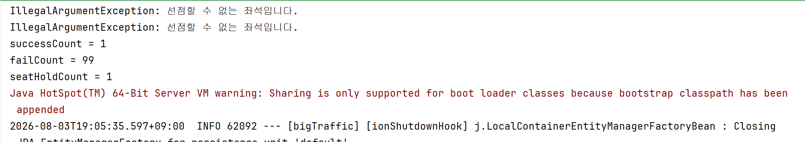
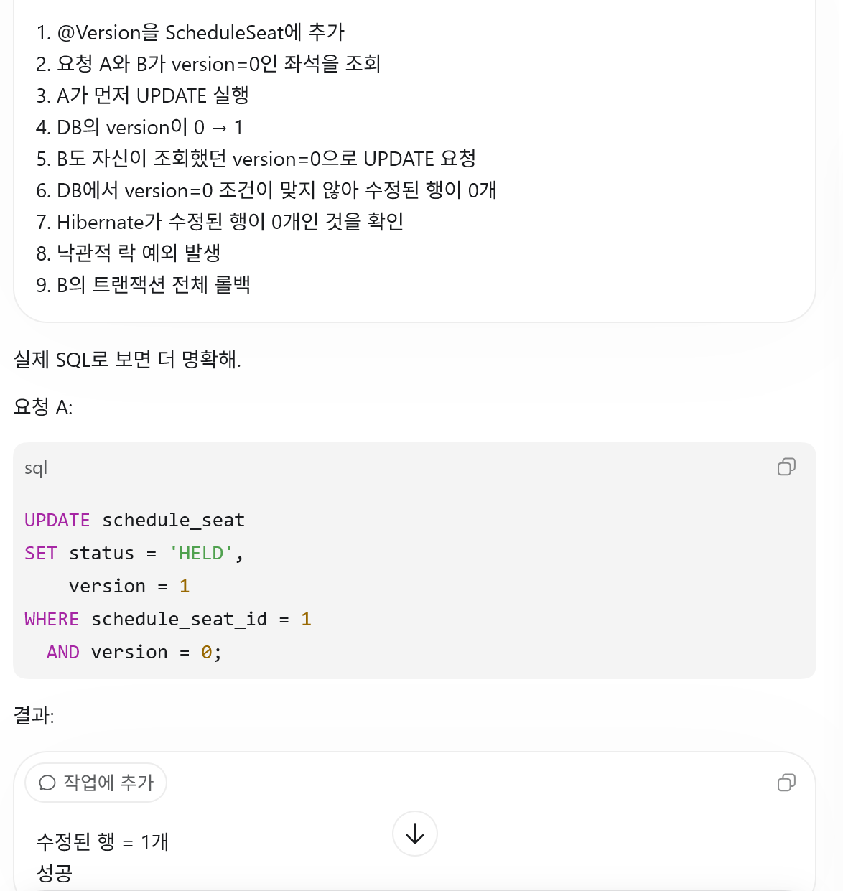
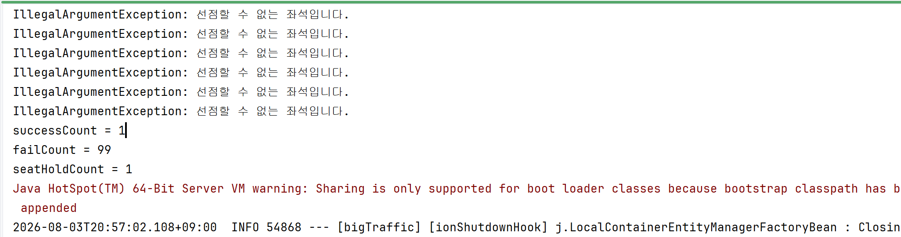
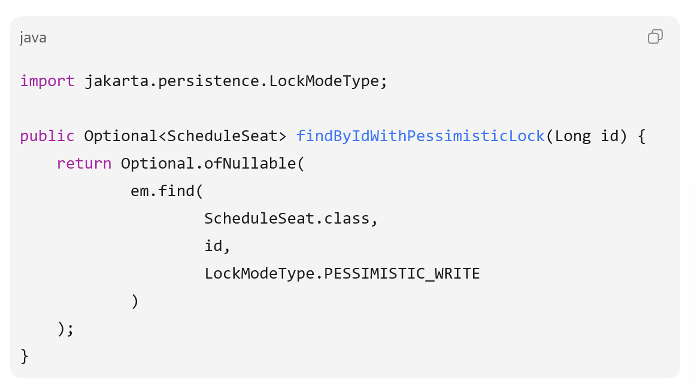
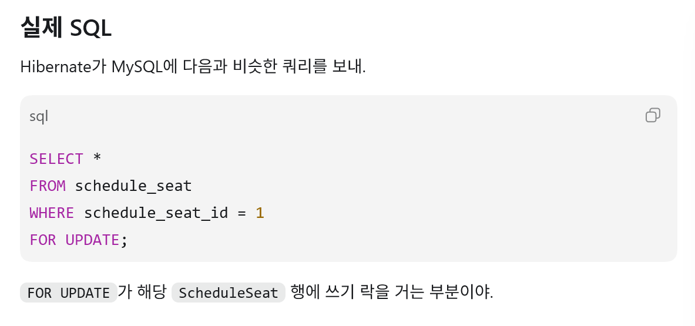
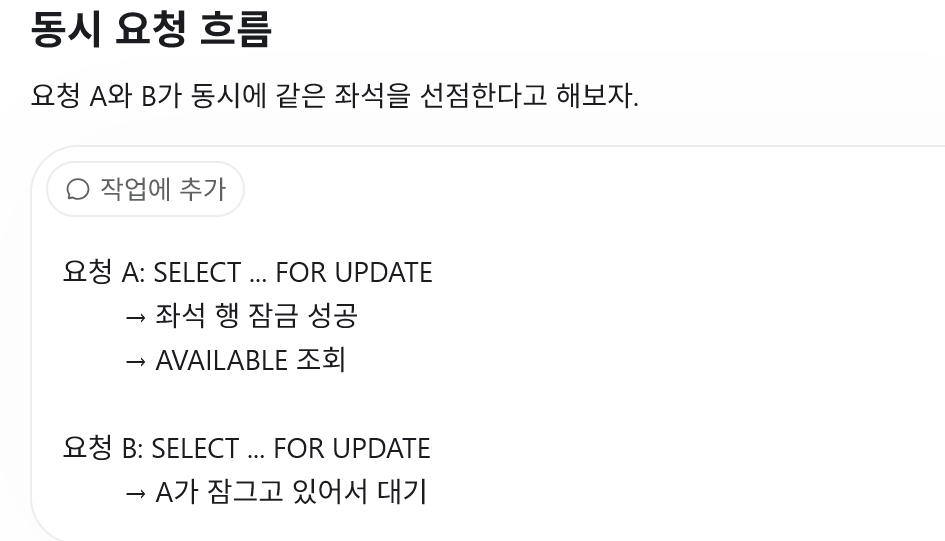
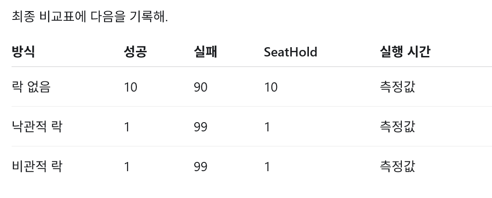

# 낙관적 락과 비관적 락 비교

## 1. 락이 필요한 이유

현재 좌석 선점 로직은 다음 순서로 동작한다.

```text
ScheduleSeat 조회
-> AVAILABLE인지 확인
-> HELD로 변경
-> SeatHold 저장
```

요청 A와 요청 B가 같은 좌석을 동시에 조회하면 두 요청 모두
`AVAILABLE` 상태를 읽을 수 있다. 그러면 둘 다 `hold()` 검사를 통과해서
하나의 좌석에 여러 개의 `SeatHold`가 만들어질 수 있다.

```text
요청 A: AVAILABLE 조회 -----------------> HELD 변경
요청 B: AVAILABLE 조회 -----------------> HELD 변경
```

`@Transactional`만 사용한다고 해서 이 문제가 자동으로 해결되지는 않는다.
각 트랜잭션이 동시에 같은 값을 읽을 수 있기 때문이다.

---

## 2. 낙관적 락(Optimistic Lock)

낙관적 락은 **동시 수정이 자주 발생하지 않을 것이라고 가정하고, 우선 작업한 뒤
저장할 때 충돌을 검사하는 방식**이다.

DB 행을 먼저 잠그지 않는다. 대신 `version` 값을 이용하여 내가 조회한 이후에
다른 트랜잭션이 데이터를 변경했는지 확인한다.

### JPA 설정

`ScheduleSeat` 엔티티에 `@Version` 필드를 추가한다.

```java
@Version
private Long version;
```

DB에는 다음과 같은 컬럼이 생긴다.

```text
schedule_seat_id | status    | version
1                | AVAILABLE | 0
```

### 동작 과정

요청 A와 B가 동시에 `version = 0`인 좌석을 조회했다고 가정한다.

```text
요청 A: status=AVAILABLE, version=0 조회
요청 B: status=AVAILABLE, version=0 조회

요청 A: 수정 성공, version 0 -> 1
요청 B: version=0을 조건으로 수정하지만 현재 값은 1이므로 실패
```

Hibernate는 개념적으로 다음과 같은 SQL을 실행한다.

```sql
UPDATE schedule_seat
SET status = 'HELD', version = 1
WHERE schedule_seat_id = 1
  AND version = 0;
```

수정된 행이 0개이면 JPA는 다른 트랜잭션이 먼저 수정했다고 판단하고
낙관적 락 예외를 발생시킨다. 이때 현재 트랜잭션 전체가 롤백되므로 같은
트랜잭션에서 저장한 `SeatHold`도 함께 취소된다.

Spring/JPA 환경에서는 최종적으로 `ObjectOptimisticLockingFailureException` 같은
예외로 전달될 수 있다.

### 특징

- 조회할 때 DB 행을 잠그지 않는다.
- 충돌이 없으면 대기 시간이 적다.
- 충돌한 요청은 실패하므로 예외 처리나 재시도 정책이 필요할 수 있다.
- 충돌이 적고 읽기가 많은 데이터에 유리하다.
- 인기 좌석처럼 같은 행에 요청이 집중되면 실패와 재시도가 많아질 수 있다.

---

## 3. 비관적 락(Pessimistic Lock)

비관적 락은 **동시 수정이 발생할 것이라고 가정하고, 데이터를 조회하는 순간부터
DB 행을 잠그는 방식**이다.

한 트랜잭션이 좌석을 수정하는 동안 다른 트랜잭션은 같은 좌석을 수정하지 못하고
락이 풀릴 때까지 기다린다.

### 현재 Repository 방식의 JPA 설정

현재 프로젝트는 `EntityManager`를 직접 사용하므로 락 조회 메서드를 다음과 같이
만들 수 있다.

```java
public Optional<ScheduleSeat> findByIdForUpdate(Long id) {
    return Optional.ofNullable(
            em.find(ScheduleSeat.class, id, LockModeType.PESSIMISTIC_WRITE)
    );
}
```

서비스에서는 일반 `findById()` 대신 이 메서드를 `@Transactional` 안에서 호출한다.

```java
@Transactional
public SeatHoldResponse createHold(Long scheduleSeatId, Long memberId) {
    ScheduleSeat scheduleSeat = scheduleSeatRepository
            .findByIdForUpdate(scheduleSeatId)
            .orElseThrow(() -> new IllegalArgumentException("좌석이 존재하지 않습니다."));

    scheduleSeat.hold();
    // SeatHold 저장
}
```

MySQL에서는 개념적으로 다음 SQL이 사용된다.

```sql
SELECT *
FROM schedule_seat
WHERE schedule_seat_id = 1
FOR UPDATE;
```

### 동작 과정

```text
요청 A: 좌석 조회와 동시에 행 잠금
요청 B: 같은 좌석을 조회하려 하지만 대기
요청 A: HELD 변경 후 커밋, 행 잠금 해제
요청 B: 조회 계속, 변경된 HELD 상태 확인
요청 B: hold()에서 선점 실패
```

### 특징

- MySQL InnoDB의 실제 행 잠금을 사용한다.
- 먼저 락을 획득한 요청이 처리되는 동안 다른 요청은 대기한다.
- 충돌이 자주 발생해도 데이터 흐름을 이해하기 쉽다.
- 트랜잭션이 길어지면 대기 시간과 DB 부하가 커진다.
- 여러 행을 서로 다른 순서로 잠그면 데드락이 발생할 수 있다.
- 반드시 트랜잭션 안에서 조회하고, 트랜잭션을 짧게 유지해야 한다.

---

## 4. 차이 비교

| 구분 | 낙관적 락 | 비관적 락 |
|---|---|---|
| 핵심 생각 | 충돌이 적을 것으로 예상 | 충돌이 많을 것으로 예상 |
| 충돌 처리 시점 | 저장할 때 감지 | 조회할 때부터 차단 |
| DB 행 잠금 | 먼저 잠그지 않음 | `FOR UPDATE`로 잠금 |
| JPA 핵심 기능 | `@Version` | `PESSIMISTIC_WRITE` |
| 충돌한 요청 | 예외 발생 | 락이 풀릴 때까지 대기 |
| 장점 | 충돌이 적으면 빠르고 대기가 적음 | 충돌이 많아도 순차 처리가 명확함 |
| 단점 | 충돌이 많으면 실패와 재시도 증가 | 대기, 타임아웃, 데드락 가능 |
| 적합한 상황 | 일반 게시글 수정, 회원 정보 등 | 재고 차감, 인기 좌석 선점 등 |

---

## 5. MySQL과 JPA의 역할

낙관적 락은 MySQL에 `OPTIMISTIC LOCK`이라는 별도 명령이 있는 것이 아니다.
JPA가 `version` 컬럼을 SQL의 `WHERE` 조건에 넣어서 충돌을 감지한다.

```text
낙관적 락
JPA/Hibernate가 version 비교를 관리
-> MySQL은 조건이 맞는 행만 UPDATE

비관적 락
JPA가 PESSIMISTIC_WRITE를 요청
-> MySQL InnoDB가 실제 행 잠금을 관리
```

따라서 《Real MySQL 8.0》에서는 InnoDB의 레코드 락, 갭 락,
넥스트 키 락, 데드락 같은 비관적 락의 기반을 주로 학습한다. `@Version`과
낙관적 락 예외 처리는 JPA에서 별도로 학습해야 한다.

---

## 6. 현재 좌석 프로젝트에서는 무엇을 선택할까?

지금 바로 락부터 적용하지 않는다. 먼저 같은 `scheduleSeatId`에 여러 요청을
동시에 보내서 중복 선점 문제가 실제로 발생하는지 확인해야 한다.

권장 실습 순서는 다음과 같다.

1. 락이 없는 현재 코드로 100개의 동시 요청을 실행한다.
2. 성공 요청 수와 생성된 `SeatHold` 개수를 기록한다.
3. 낙관적 락을 적용하고 결과와 예외 수를 기록한다.
4. 비관적 락을 적용하고 결과와 대기 시간을 기록한다.
5. 처리 시간, 성공 수, 실패 수를 비교하여 선택 근거를 작성한다.

좌석 선점은 같은 인기 좌석에 요청이 집중될 수 있으므로 비관적 락이 이해하기
쉽고 확실한 첫 해결책이 될 수 있다. 그러나 어느 방식이 무조건 더 좋다고 먼저
결론 내리지 말고, 이 프로젝트의 실제 동시성 테스트 결과를 근거로 선택해야 한다.

## 7. 꼭 기억할 내용

```text
@Transactional만으로 동시성 문제는 해결되지 않는다.

낙관적 락 = 먼저 작업하고 version으로 충돌을 발견한다.
비관적 락 = 먼저 DB 행을 잠그고 다른 요청을 기다리게 한다.

낙관적 락의 충돌 결과 = 예외
비관적 락의 충돌 결과 = 대기, 경우에 따라 타임아웃이나 데드락
```
### 8.결과 
- 낙관적 락 (@Version 추가)

- 


- 비관적 락()

- 
- 
- 

### -> SQL 표시

Hibernate:  
select    
m1_0.member_id,   
m1_0.name  
from  
member m1_0  
where  
m1_0.member_id=?  

Hibernate:   
select   
ss1_0.schedule_seat_id,  
ss1_0.name,  
s1_0.schedule_id,  
e1_0.event_id,   
e1_0.event_name,  
s1_0.start_time,  
s2_0.seat_id,  
s2_0.seat_name,  
ss1_0.status  
from  
schedule_seat ss1_0

left join      
schedule s1_0   
on s1_0.schedule_id=ss1_0.schedule_id   

left join     
event e1_0    
on e1_0.event_id=s1_0.event_id   

left join   
seat s2_0   
on s2_0.seat_id=ss1_0.seat_id   

where
ss1_0.schedule_seat_id=?   
for updateof ss1_0     -> 단순 조회가아닌 수정할려고 조회와 동시에 락을 건거임    
IllegalArgumentException: 선점할 수 없는 좌석입니다.


최종 결과 



