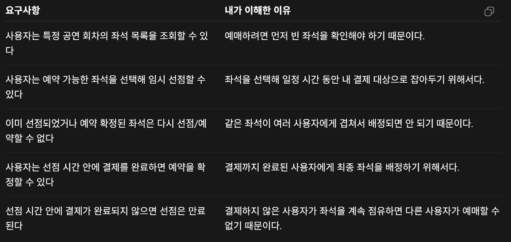
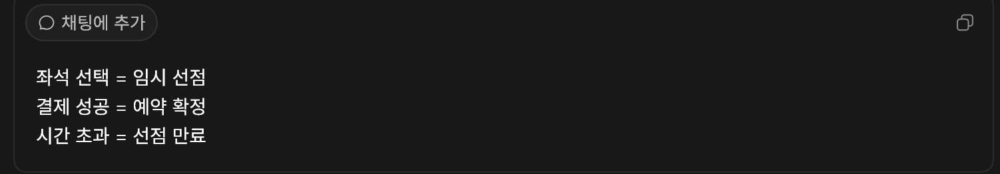

## 오늘 To-do

1. [ ] 예매 시스템 요구사항 예시를 읽고 각 항목 옆에 '왜 필요한지' 한 줄 적기
2. [ ] 트래픽 문제 예시를 읽고 각 항목 옆에 '왜 문제가 될 수 있는지' 한 줄 적기
3. [ ] 모르는 단어 목록 만들기: 회차, 좌석 재고, 선점, 만료, 멱등성
4. [ ] 오늘은 직접 설계하려고 하지 말고, 문제를 이해하는 데 집중하기

### 요구사항 정리

요구사항 하는이유 : 내가 뭘 만들 건지 기준선을 잡기 위해서

# 트래픽 문제상황 파트 정리 5가지

### 같은 좌석 동시 선점

- 문제: 같은 좌석에 여러 사용자가 동시에 선점 요청을 보낸다.
- 왜 생길 수 있는가?: 인기 공연에서는 여러 사용자가 거의 동시에 같은 좌석을 선택할 수 있기 때문이다.
- 나중에 어떻게 확인할 것인가?: 같은 `scheduleSeatId`에 100개 동시 요청을 보내본다.
- 연결되는 개념: Race Condition, Transaction, Lock

#### 의견

동시에 같은 좌석을 예약하면 서버는 누구를 예약하게 할까?  
락이나 검증이 없다면 같은 좌석 예약 데이터가 DB에 2개 저장될 수도 있을 것 같다.

### 좌석 조회 요청 폭증

- 문제: 특정 회차의 좌석 조회 요청이 짧은 시간에 많이 들어올 수 있다.
- 왜 생길 수 있는가?: 사용자가 남은 좌석을 계속 확인하거나 새로고침할 수 있기 때문이다.
- 나중에 어떻게 확인할 것인가?: k6로 좌석 조회 API에 반복 요청을 보낸다.
- 연결되는 개념: Cache, Redis, Index, p95 latency

#### 의견

좌석 조회 요청이 많아지면 매번 DB를 조회하게 되어 DB에 부담이 커질 것 같다.  
그래서 좌석 목록을 Redis 같은 캐시에 저장해두고, 반복 조회는 캐시가 대신 응답하게 만들 수 있을 것 같다.

다만 좌석이 선점되거나 예약/취소되어 상태가 바뀌면 캐시 데이터가 오래된 정보가 될 수 있다.  
그래서 처음에는 좌석 상태가 변경될 때 해당 회차의 좌석 캐시를 삭제하는 방식으로 처리하면 좋을 것 같다.

### 선점 후 결제하지 않는 사용자

- 문제: 사용자가 좌석을 선점하고 결제하지 않을 수 있다.
- 왜 생길 수 있는가?: 결제 중 자리를 이탈하거나 브라우저를 닫을 수 있기 때문이다.
- 나중에 어떻게 확인할 것인가?: 선점 시간이 지난 후 좌석이 다시 `AVAILABLE`이 되는지 테스트한다.
- 연결되는 개념: TTL, Scheduler, State

#### 의견

사용자가 좌석을 선점한 뒤 결제하지 않고 이탈하면, 그 좌석은 실제로는 팔린 좌석이 아닌데도 다른 사용자에게는 선택할 수 없는 좌석처럼 보일 수 있다.  
그러면 다른 사용자는 매진이라고 착각하거나 원하는 좌석이 없다고 생각해서 브라우저를 이탈할 수 있을 것 같다.

그래서 선점에는 제한 시간이 필요하고, 시간이 지나면 좌석 상태를 다시 `AVAILABLE`로 돌려야 할 것 같다.

### 결제 중복 요청

- 문제: 같은 결제 요청이 여러 번 들어올 수 있다.
- 왜 생길 수 있는가?: 사용자가 결제 버튼을 여러 번 누르거나 네트워크 재시도로 요청이 반복될 수 있기 때문이다.
- 나중에 어떻게 확인할 것인가?: 같은 결제 요청을 여러 번 보내도 결제가 한 번만 처리되는지 테스트한다.
- 연결되는 개념: Idempotency, Unique Key

#### 의견

결제 요청이 중복으로 처리되면 같은 사용자가 두 번 결제될 수 있고, 이후 환불 처리가 필요해져 운영 비용과 사용자 불만이 생길 수 있을 것 같다.

그래서 결제 요청마다 고유한 요청 ID를 부여하고, 이미 처리된 요청 ID가 다시 들어오면 새 결제로 처리하지 않도록 막아야 할 것 같다.  
예를 들어 `idempotencyKey` 같은 값을 저장해두고, 같은 키로 다시 요청이 들어오면 기존 결제 결과를 반환하거나 중복 요청으로 처리하면 될 것 같다.

### 서버/DB가 한 번에 너무 많은 요청을 받음

- 문제: 예매 시작 시점에 요청이 몰려 서버나 DB가 감당하지 못할 수 있다.
- 왜 생길 수 있는가?: 인기 공연은 많은 사용자가 같은 시간에 접속하기 때문이다.
- 나중에 어떻게 확인할 것인가?: k6로 VU를 늘려가며 실패율과 응답시간을 본다.
- 연결되는 개념: Queue, Rate Limit, Connection Pool, Load Test

#### 의견

서버나 DB에 너무 많은 요청이 한 번에 들어오면 응답 시간이 길어지거나 실패가 발생할 수 있을 것 같다.  
그래서 모든 요청을 바로 처리하지 않고, 대기열을 두거나 일정 수의 사용자만 순서대로 입장시키는 방식이 필요할 것 같다.

또는 요청 수를 제한하는 Rate Limit을 적용해서 서버와 DB가 감당할 수 있는 만큼만 처리하게 만들 수 있을 것 같다.

---
#### Seat 과 schedulSeat이 뭐가 다른가? 

Seat는 좌석 자체를 의미한다. 예를 들면 A-1, A-2 같은 물리적 좌석이다.

ScheduleSeat는 특정 공연 회차에 포함된 좌석을 의미한다.  
즉 공연 시간과 회차가 반영된 실제 예매 대상 좌석이다.

같은 A-1 좌석이라도 6월 22일 14시 공연의 A-1과 6월 22일 19시 공연의 A-1은 서로 다른 예매 재고다.
그래서 Seat와 ScheduleSeat를 나눠야 한다.