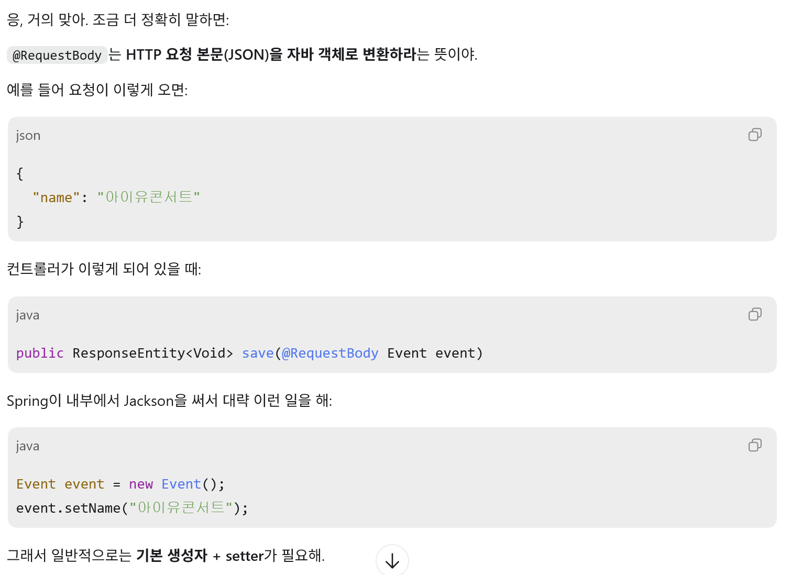

### 오류메세지 
- No EntityManager with actual transaction available
cannot reliably process 'persist' call

- 원인     
POST 요청으로 저장하려 했는데, 저장 메서드에 트랜잭션이 안 걸려 있어서 JPA가 persist를 거부한 거야.

- 원인   
  @RequestBody로 받은 객체에 name 값을 넣어야 하는데
  Event에 setName()이 없어서 값 주입이 안 됨
### 오류메세지 
- [Request processing failed: org.springframework.dao.DataIntegrityViolationException: not-null property references a null or transient value for entity Challenge_summer.bigTraffic.domain.Event.name] with root cause

- 엔티티에 SET을 쓰지않은이유 엔티티값을 바꾸면 안되기에    
-> 해결 DTO를 쓸 껏   
